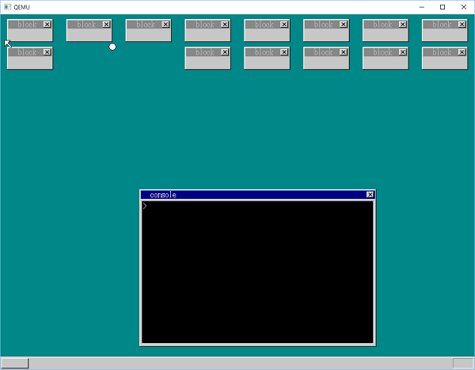
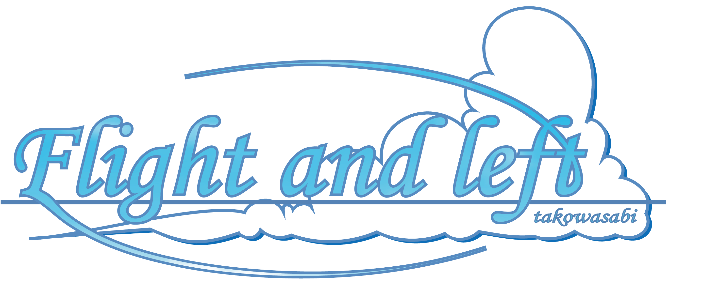
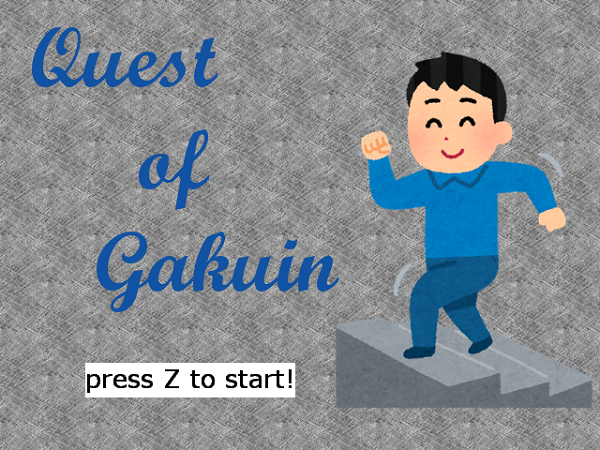
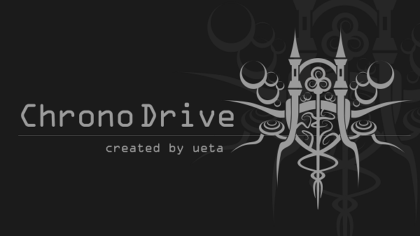
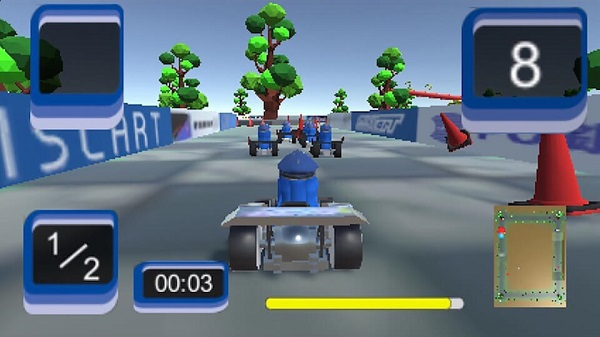
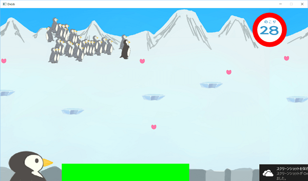
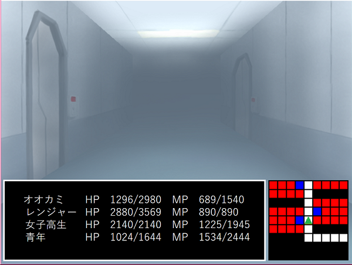
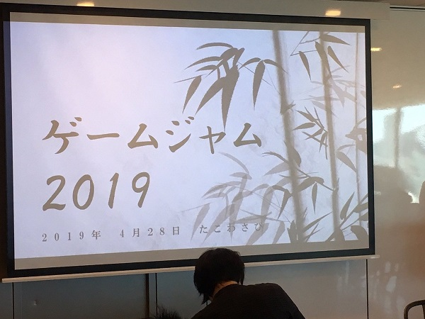
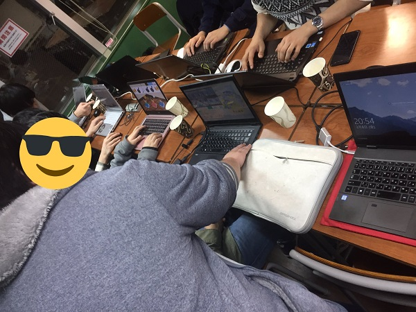

takowasabi
==

これは、簡易的に作成したプログラマ志望の学生takowasabiのポートフォリオサイトです。

## 基本ステータス

|項目|内容|
|--|--|
|ハンドルネーム|takowasabi、ワーサー王 etc...|
|趣味|RPG全般、デジタルカードゲーム、ゲーム開発、他学科の講義に潜る、技術書|
|興味のあるもの|ゲームエンジン、リアルタイムレンダリング、プログラミング言語、コンパイラ、オペレーティングシステム、並列処理、マネージメント etc...|
|資格とか|応用情報処理技術者、日商簿記3級、ファイナンシャルプランニング技能士検定3級、2017物理学会jrセッション 審査員特別賞|
|職歴（インターンシップとか）|[Cygames](https://www.cygames.co.jp/)、[Fixstars](https://www.fixstars.com/ja/)|

## 会得スキル

|スキル名|熟練度|
|--|--|
|C|講義とか、サブセットのコンパイラ作ったりとか、OS作ったりとか|
|C++|ゲーム開発とか、ライブラリ開発とか、グラフィックスライブラリ動かしたりとか、GPU動かしたりとか、OS作ったりとか|
|C#|LinqとRxが楽しい、Unityで使ったりとか|
|Python|深層学習のモデル構築とか、Kaggleとか、ちょっとしたデータ解析とか、GPU動かしたりとか|
|MarkDown|授業ノートも全部これで書いてる、依存症|
|Linux/vim/git/make/cmake|アルバイト業務とか、gccで開発するときとか|
|CUDA/TensorRT/Nsight/NVVP|アルバイト業務とか、GPU動かすときとか|
|Unity/Siv3D/DxLib/Processing|ゲーム開発とか、簡単なシュミレーションとか、アルゴリズム可視化とか|
|Go/Rust/Haskell|チュートリアルレベルの知識|

## コレクション

### 個人で作ったもの

- kaOS（製作中）

    C++で製作しているOSです。オブジェクト指向での構造化と、独自のメモリ管理の実装を行いました。[Github](https://github.com/takowasaby/kaOS)

- hariball

    

    「30日でできるOS自作入門」を参考に、カーネルのレイヤでブロック崩しの処理を行う謎のOSを作成しました。[GitHub](https://github.com/takowasaby/hariball)

    製作の過程は[こちら](https://twitter.com/hashtag/takowasabiostutorial?f=tweets&vertical=default&src=hash)から見ることが出来ます。

- KingRx

    C#やJavaなどで良く用いられるReactiveExtensionsの学習をするために、.Netの実装を参考にいくらかをC++で書いてみました。[GitHub](https://github.com/takowasaby/KingRx)

- Flight And Left

    

    C++とSiv3Dで制作した、縦スクロールから一つの操作で横スクロールに変化する特殊な仕様のシューティングゲーム。タイトルロゴは自作です。[GitHub](https://github.com/takotakowasabi/FlightAndLeft)

- Quest of Gakuin

    

    C++とDxLibで制作した、初めてのゲーム制作作品。疑似3Dのダンジョンを探索してゴールを目指します。[GitHub](https://github.com/takotakowasabi/QuestOfGakuin)

### チームで作ったもの

- ChronoDrive（製作中）

    

    現在10人程度のチームで制作している、VRロボットアクションゲームです。リードエンジニアとして、タスク分割やテストの導入、設計などを行っています。

- MIS CART

    

    Unityを用いて素材含め20人程度で制作し、2018年早稲田祭にて発表したカジュアルなレーシングゲームです。[作品紹介ページ](https://misw.jp/portfolio/mis-cart/)

- PenguinLife

    

    MIS.Wゲームジャム2018で制作したアクションゲームです。3日間で、プログラミング初心者にC++やDxLibについて教えながら制作しました。[作品紹介ページ](https://misw.jp/portfolio/penguinlife/)

- KNOTS

    

    プログラマ6人でC++とDxLibを用いて制作したダンジョンRPGです。プログラミングを始めて間もない頃に、タスク分割やGitに苦戦しながら、何とか2017年早稲田祭にて発表することが出来ました。[作品紹介ページ](https://misw.jp/portfolio/knots/)

### 開催したイベント

- MIS.Wゲームジャム2019

    

    ゲームを短期間で開発するイベント「ゲームジャム」をサークル員50人で行い、その運営を行いました。例年会議室などを借りて行っていたところを、[株式会社ミクシィ](https://mixi.co.jp/)と交渉し、会場を提供していただきました。[開催報告記事](https://blog.misw.jp/entry/2019/05/20/125156)

- ChronoDriveゲームジャム

    

    ゲーム制作を行うプロジェクトの中で、教育を目的として4人ずつ2チームでゲームジャムを行いました。[使用スライド](https://www.slideshare.net/yusuketomioka/chronodrive)

- OpenProcessing体験会

    ブラウザ上でProcessingのような簡単な描画を行うことのできるサービス[OpenProcessing](https://www.openprocessing.org/)を用いて実際に開発を行うイベントを、サークル内で開催しました。[使用スライド](https://www.slideshare.net/yusuketomioka/openprocessing)

### 書いた記事とかブログ

- ワーサー王列伝

    自分で調べたこととかをまとめていく予定の個人ブログです。[ワーサー王列伝](https://warhur.hatenablog.com/)

- GPUでプログラミング（MIS.W公式ブログ）

    CUDAを用いてGPUで当たり判定を行うプログラムを作成し、その工程をブログにて紹介しました。[GPUでプログラミング - MIS.W公式ブログ](https://blog.misw.jp/entry/2019/04/11/000000)

- SSDにMobileNetを組み込んで軽量化する（Fixstars Tech Blog）

    インターンシップで取り組んだリアルタイム物体検出の計算と重みのデータ量の軽量化についてのまとめを、インターンシップをさせて頂いたFixstars社のTech Blogにて公開することが出来ました。

    [SSDにMobileNetを組み込んで軽量化する[1] - Fixstars Tech Blog](http://proc-cpuinfo.fixstars.com/2018/12/mobilenet-ssd-1/)

    [SSDにMobileNetを組み込んで軽量化する[2] - Fixstars Tech Blog](http://proc-cpuinfo.fixstars.com/2019/03/mobilenet-ssd-2/)

    具体的なソースコードは[こちら](https://github.com/takotakowasabi/MobileNet_SSD)にて公開しています。

### その他

- OpenGL入門

    よりレイヤの低いグラフィックスライブラリを学ぶ一環として、OpenGLの学習に取り組んでいます。足跡は[こちら](https://twitter.com/hashtag/takowasabigltutorial?f=tweets&vertical=default&src=hash)にて確認することが出来ます。

- Processingでレイトレを実装

    次世代のレンダリング技術として注目されているレイトレーシングを、Processingで実際に実装しながら学びました。[GitHub](https://github.com/takotakowasabi/ray_tracing)

- Kaggle

    機械学習やデータ分析の学習のため、チームでKaggleに取り組んでいました。結果としては一つのコンペティションで銀メダルを獲得することが出来ました。[kaggleマイページ](https://www.kaggle.com/takowasabi)

## リンク

- Github

    - https://github.com/takotakowasabi （新しめ）
    - https://github.com/takowasaby （古め）

- Twitter

    - https://twitter.com/oreTakowasabi
